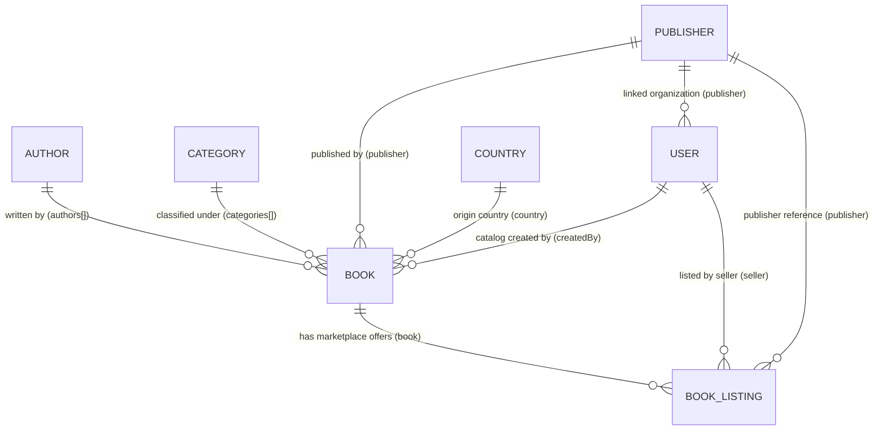

# Bookstore Domain Architecture & Entity Relationship Model

This document explains how **Books**, **Book Listings**, **Authors**, **Categories**, **Publishers**, **Countries**, and **Users (Sellers)** are designed and interconnected in the marketplace backend.

---

## 1. High-Level Entity Relationship Diagram



---

## 2. Core Architectural Concept: Canonical Books vs. Seller Listings

In an e-commerce marketplace (like Amazon or Flipkart), **one physical book title can be sold by multiple independent sellers at different prices and stock levels**.

### 🔹 The Canonical Book (`BookModel`)
* Represents the **universal, immutable bibliographic metadata** of a book.
* **Never changes** regardless of who sells it.
* Stored **once** in the database.
* **Fields**:
  - `title`, `titleBn`: English & Bengali title
  - `slug`: URL slug (e.g. `clean-code-handbook`)
  - `isbn`: Unique ISBN code
  - `authors`: Array of references to `Author`
  - `publisher`: Reference to `Publisher`
  - `categories`: Array of references to `Category`
  - `country`: Reference to `Country`
  - `description`, `coverImage`, `images`, `pages`, `edition`, `language`, `searchTags`
  - `createdBy`: User (Seller or Admin) who registered the canonical book metadata

> [!IMPORTANT]
> **Why `Book` does NOT contain seller stock:**
> If `Book` stored `stock: 10`, what happens when Seller A has 50 copies and Seller B has 20 copies? Storing stock inside `Book` would cause race conditions and data corruption across independent sellers.

---

### 🔹 The Marketplace Offer (`BookListingModel`)
* Represents an **individual seller's inventory and commercial offer** for a canonical book.
* Stored **per (Book, Seller) pair**.
* **Fields**:
  - `book`: Reference to `Book`
  - `seller`: Reference to `User` (role: `SELLER` or `ADMIN`)
  - `publisher`: Reference to `Publisher`
  - `mrpInPaise`: Maximum Retail Price (e.g. `₹550.00` = `55000` paise)
  - `sellingPriceInPaise`: Seller's actual discounted price (e.g. `₹450.00` = `45000` paise)
  - `stock`: Available inventory for **this specific seller** (e.g. `25` units)
  - `sku`: Seller's internal SKU code (e.g. `SKU-OXFORD-001`)
  - `isActive`: Toggle listing visibility on the marketplace

---

## 3. Detailed Entity Relationship Breakdown

| Entity | Collection | Key Fields | References / Relations | Responsibility |
| :--- | :--- | :--- | :--- | :--- |
| **`Author`** | `authors` | `name`, `nameBn`, `slug`, `photo`, `bio` | Independent entity | Author biography and profile |
| **`Category`** | `categories` | `name`, `nameBn`, `slug`, `icon` | Independent entity | Genre and hierarchical taxonomy |
| **`Publisher`** | `publishers` | `name`, `nameBn`, `slug`, `logo`, `website` | Independent entity | Publishing house profile |
| **`Country`** | `countries` | `name`, `code` (e.g. `IN`), `phoneCode` | Independent entity | Country of origin and geolocation |
| **`User`** | `users` | `name`, `email`, `role`, `publisher` | `publisher` -> `Publisher` (optional) | Buyers, independent sellers, publisher accounts |
| **`Book`** | `books` | `title`, `slug`, `isbn`, `coverImage` | `authors` -> `Author[]`<br>`publisher` -> `Publisher`<br>`categories` -> `Category[]`<br>`country` -> `Country`<br>`createdBy` -> `User` | Single Source of Truth for book metadata |
| **`BookListing`** | `booklistings` | `mrpInPaise`, `sellingPriceInPaise`, `stock`, `sku` | `book` -> `Book`<br>`seller` -> `User`<br>`publisher` -> `Publisher` | Multi-seller inventory, stock & price isolation |

---

## 4. Real-World Marketplace Scenarios

### Scenario 1: Seller A Adds a New Book
1. **Seller A** submits the "Add Book" form:
   - Metadata: Title `"The Hound of the Baskervilles"`, Author `Arthur Conan Doyle`, Publisher `Penguin Books`, Category `Mystery`.
   - Inventory: Price `₹399.00` (`39900` paise), Stock `50` units.
2. **Backend Action**:
   - Creates 1 `Book` document with all metadata.
   - Automatically creates 1 `BookListing` document for **Seller A**:
     ```json
     {
       "book": "BOOK_ID_1",
       "seller": "SELLER_A_ID",
       "publisher": "PENGUIN_ID",
       "sellingPriceInPaise": 39900,
       "stock": 50,
       "isActive": true
     }
     ```

---

### Scenario 2: Seller B Sells the Same Book
1. **Seller B** wants to sell the same book, but at a lower price `₹349.00` with `25` units in stock.
2. **Backend Action**:
   - Reuses existing `BOOK_ID_1` (no duplicate book record created).
   - Creates a second `BookListing` document for **Seller B**:
     ```json
     {
       "book": "BOOK_ID_1",
       "seller": "SELLER_B_ID",
       "publisher": "PENGUIN_ID",
       "sellingPriceInPaise": 34900,
       "stock": 25,
       "isActive": true
     }
     ```

---

### Scenario 3: Buyer Views the Book Page
When a buyer navigates to `/books/the-hound-of-the-baskervilles`:
* **Canonical Book Information**: Title, Author bio, Categories, Publisher logo, Description, Cover image.
* **Available Seller Offers**:
  1. 🥇 **Seller B**: ₹349.00 (In Stock: 25) — *Best Price Box (Buy Box)*
  2. 🥈 **Seller A**: ₹399.00 (In Stock: 50) — *Other Sellers on Marketplace*

---

## 5. Mongoose Population & Query Patterns

### Fetching a Book with All Associated Metadata
```typescript
const book = await BookModel.findOne({ slug: "the-hound-of-the-baskervilles" })
  .populate("authors", "name nameBn slug photo bio")
  .populate("publisher", "name nameBn slug logo website")
  .populate("categories", "name nameBn slug")
  .populate("country", "name code phoneCode")
  .populate("createdBy", "name email role")
  .lean();
```

### Fetching All Active Seller Listings for a Book
```typescript
const listings = await BookListingModel.find({ book: bookId, isActive: true })
  .populate({
    path: "seller",
    select: "name email mobileNumber role publisher",
    populate: { path: "publisher", select: "name slug logo" },
  })
  .populate("publisher", "name nameBn slug logo")
  .sort({ sellingPriceInPaise: 1 }) // Lowest price first
  .lean();
```

---

## 6. Summary of Architectural Benefits

1. **Zero Data Redundancy**: Book title, description, cover image, and author details are stored once rather than repeated for every seller.
2. **True Multi-Seller Competition**: Sellers independently set their prices, discounts, and inventory without overwriting each other's data.
3. **Optimized Search & Indexing**: Search queries run against clean canonical text indexes on `BookModel`, while stock and price sorting filter through `BookListingModel`.
4. **Strong Isolation & Ownership**: Sellers can only update or delete their own `BookListing` record (`seller: req.user.id`).
